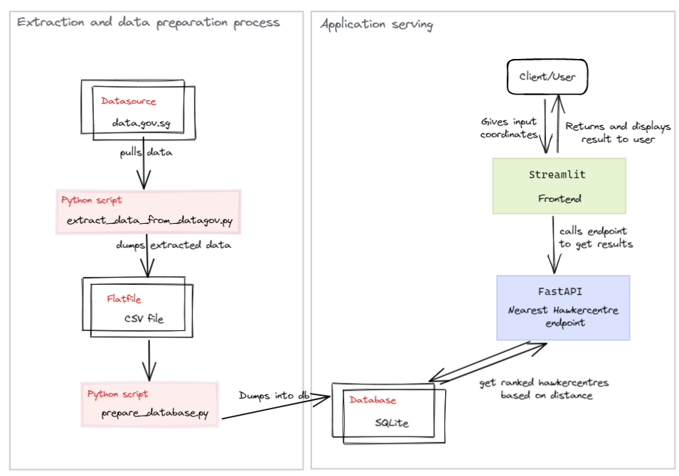

# Hawkercentre Finder Application
This repository contains the codebase for a hawker centre finder by distance.

## Components of application


## Instructions to run the application
### Set up environment
This respository is using [poetry](https://python-poetry.org/) to manage package dependencies.
To view the python version and packages used in this repository, you can view [pyproject.toml](pyproject.toml)

To install the packages, you can run the following:
```
python -m pip install --upgrade pip
pip install poetry
poetry install
```

### Local  Development
1. Run the FastApi app:
```
cd src
uvicorn app.main:app --reload
```
To access the api docs, you can go to `http://localhost:8000/docs`

2. Run the streamlit app to view the finder
```
streamlit run frontend/streamlit_app.py
```
To access the application, you can follow `http://localhost:8501`

Example of streamlit application: 


## CI Pipeline
Continuous integration pipeline has been added using GitHub Actions. 

For every pull request to the `main` branch, you will need to ensure that:
1. Lint: Code is following flake8 conventions 
```
flake8 . 
```
2. Testcases: Ensure 100% coverage for FastApi app
```
cd src
python -m pytest tests --cov-config=tests/.coveragerc --envfile=tests/.test.env --cov=app
```

## Directory
├── .github
│   ├── workflows
        └── ci.yaml # GitHub Actions CI pipeline
    ├── CODEOWNERS
    └── pull_request_template.md # template to follow for pull request
├── frontend
│   └── streamlit_app.py # main streamlit application
├── images # contains images used in this ReadMe
├── notebooks # jupyter notebooks used for experimentation
    ├── Data Extraction.ipynb
    └── Methods for Distance Calculation.ipynb
├── src # main codebase for FastAPI
    ├── app
        ├── common # contains common endpoints (i.e. `/` and `/healthz`)
            ├── models.py
            └── router.py
        ├── core # contains core functions used throughout the app
            ├── config.py
            └── logger.py
        └── nearest_hawkercentre # contains main `POST` endpoint to get nearest hawkercentre
            ├── models.py
            ├── router.py
            └── utils.py
    └── preparation_data
        ├── data # folder with raw and cleaned csv data
        ├── extract_data_from_datagov.py
        └── prepare_database.py
├── tests # test cases for FastAPI app
├── .flake8 # linting requirements
├── .gitignore
├── .pre-commit-config.yaml # precommit hooks used
├── Dockerfle.fastapi # Dockerfile if deployment is needed 
├── Dockerfle.streamlit # Dockerfile  if deployment is needed
├── poetry.lock
├── pyproject.toml
└── README.md

## Future Work
Some future work that would like to be explored:
1. Explore automation of extraction file to periodically pull and update database with newest hawker centres
2. Convert streamlit frontend web application to React framework for better scalability.
3. Explore more ways of manipulating geospatial data efficiently and adding more attributes to the hawker centre finder
